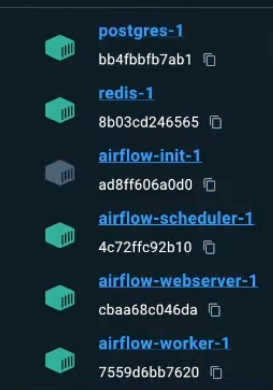
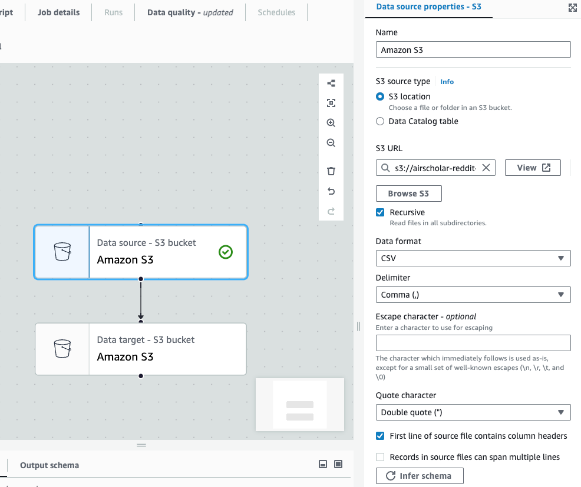
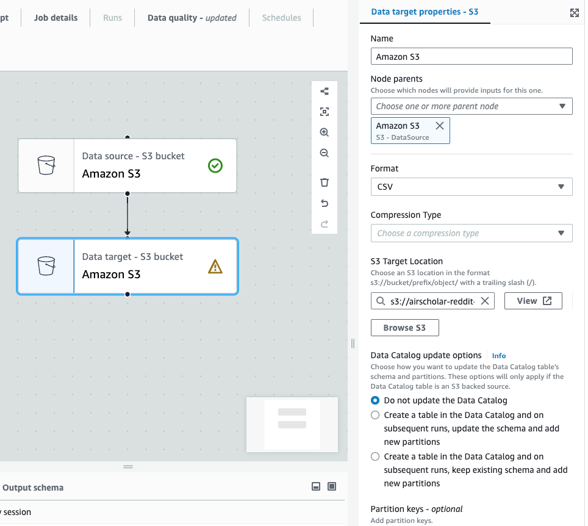
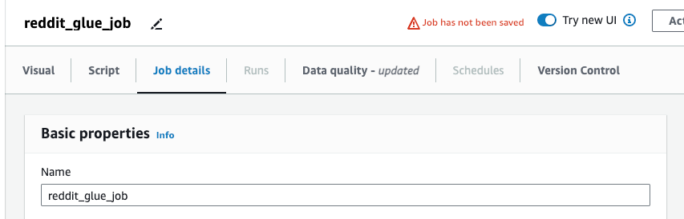
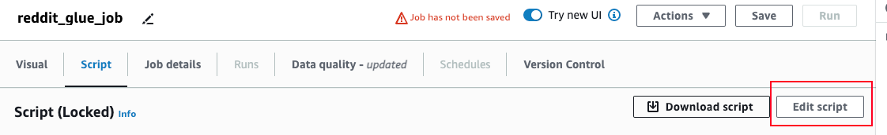
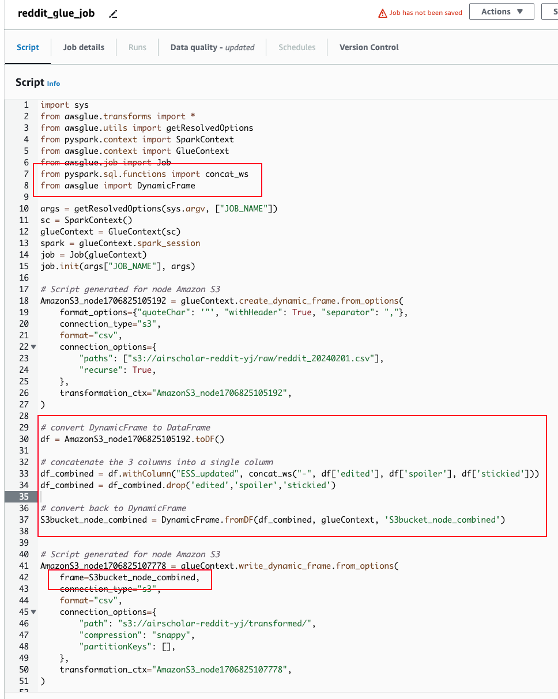
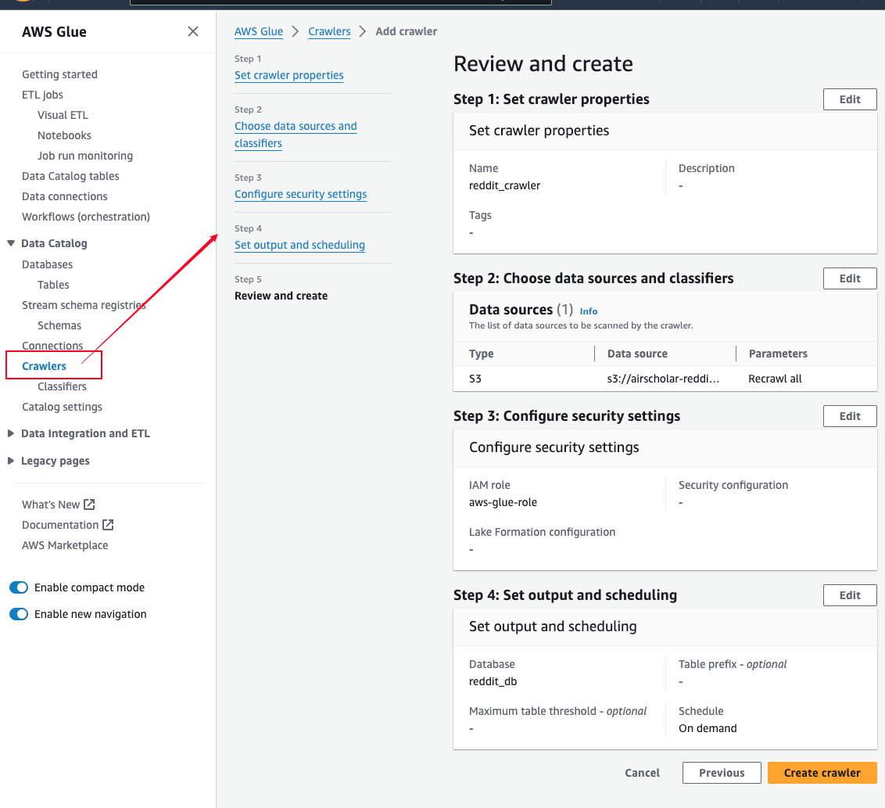
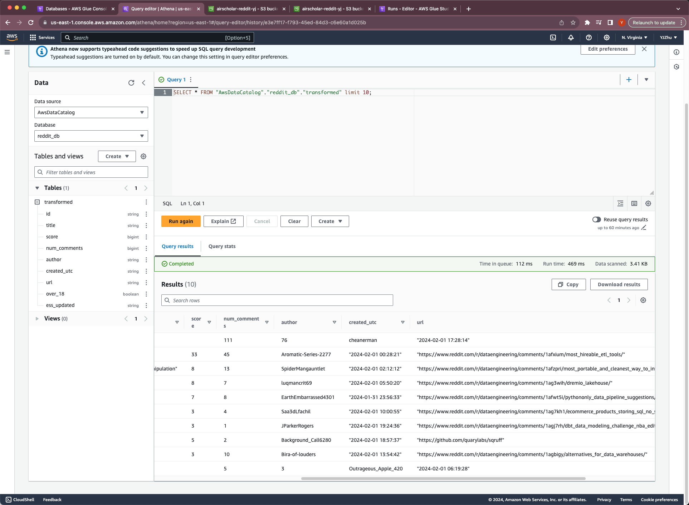

```pip install apache-airflow pandas numpy praw```

```mkdir config dags data etls logs pipelines tests utils```

```touch airflow.env docker-compose.yml Dockerfile```

```pip freeze > requirements.txt```

finish ```airflow.env```, ```docker-compose.yml```, ```Dockerfile```

```docker compose up -d --build```

open Docker Desktop, make sure services are running


write ```dags/reddit_dag.py```

```pip install configparser
pip freeze > requirements.txt
docker compose up -d --build   # rebuild the image
```

``` open http://localhost:8080```
login with user name and password from yml

In DAGs, there should be **etl_reddit_pipeline**, enable it, trigger it, click on the little green square, 

check the log to fix bugs

### Moving to AWS

After finishing writing pipelines and etls, run in terminal ```brew install awscli```

Create a S3 bucket named: airscholar-reddit-yj, update the config

Finish the s3 etl pipeline

```pip install s3fs```

rebuild Docker image: docker compose up -d --build

```docker compose down``` to remove images
```docker compose up -d``` to start

Go to airflow UI, enter the DAG, and run it, the output csv should be uploaded to s3 bucket

## AWS Glue

ETL jobs --> Visual ETL --> Sources:S3, Targets:S3





Save, and then Run the job, got to S3 to check

### create Crawler

click Run crawler, when it is finished running, go to database, click on it, click table, it will proceed to Athena to view it.

## Athena
In Settings --> Manage -->  select athena_scripts folder in S3 --> save

Here you can use SQL query to perform anaylsis

## Redshift
creat workgroup, Query data, create connection, enable charts


